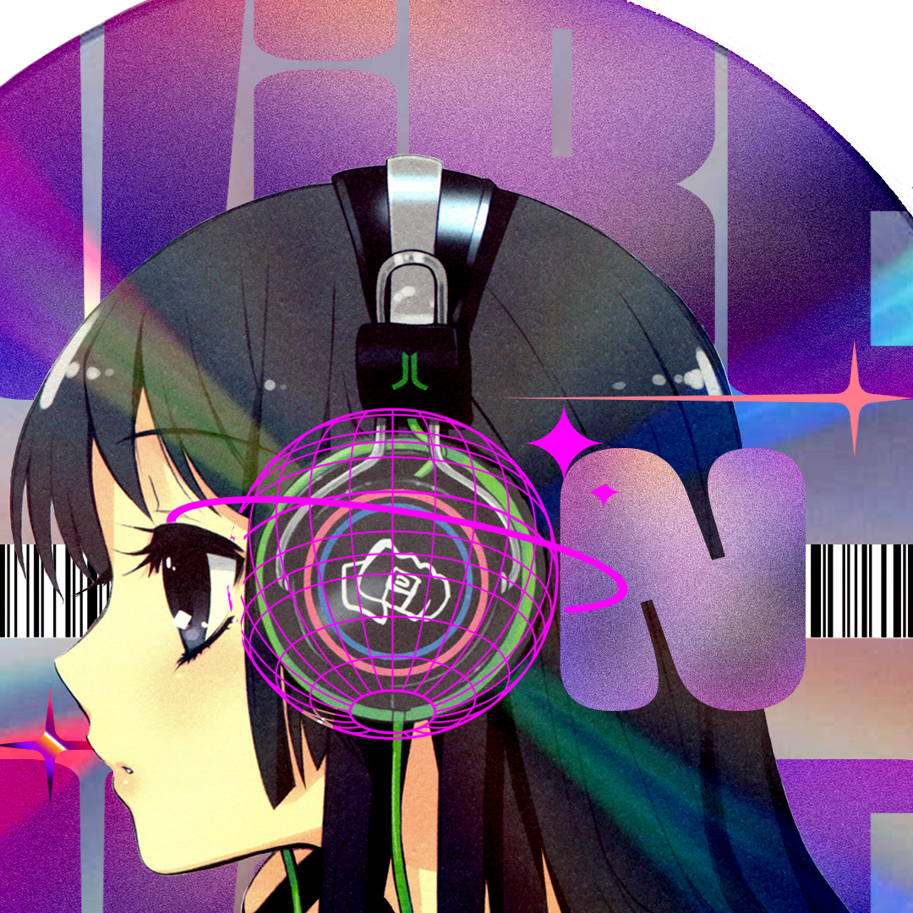

<p align="center">
  
</p>

# VIBE-ON! 🎵

> **Experience Your Music, Elevated.**

VIBE-ON! is a modern, aesthetically crafted music player built for those who care about how their music *feels*. It merges your local library with the power of the web, wrapped in a stunning, dynamically theming interface that reacts to your music in real-time.

---

## ✨ Features at a Glance

*   **🎨 Dynamic Immersion**: UI themes adapt continuously to the colors of your current track's album art using Material 3 Expressive logic.
*   **🎤 Synchronized Lyrics**: Real-time scrolling, time-coded lyrics with manual LRC file support and smart local caching.
*   **🌐 YouTube Music Integration**: Seamlessly switch between your local collection and the vast world of YouTube Music.
*   **🧲 Integrated Torrent Engine**: Search, browse, and download high-quality music directly within the application.
*   **📺 Casting Support**: Stream your favorite tunes to Chromecast and other compatible external devices.
*   **📊 Listening Statistics**: Deep insights into your listening habits with beautiful visualizations of top tracks and artists.
*   **🎧 Immersive Visuals**: Ambient backgrounds, glassmorphism, and smooth organic motion for a premium feel.
*   **📡 Discord Rich Presence**: Share what you're vibing to with your friends on Discord.
*   **⚡ Native Performance**: Powered by **Rust** and **Tauri** for a lightweight, fast, and secure experience.
*   **🎹 System Integration**: Native taskbar controls, media keys, and Windows system media integration.

---

## 📸 Preview


---

## 🎨 Design Philosophy

Vibe-On follows the **Material 3 Expressive** design system, focusing on:
- **Organic Motion**: Mathematically harmonic transitions (250ms - 500ms).
- **Soft Geometry**: Extra-large rounding (32px corners) for a friendly, modern look.
- **Contextual Theming**: Derives its entire palette from album art for maximum immersion.
- **Premium Typography**: Uses the `Outfit` geometric sans-serif for clarity and style.

---

## 🛠️ Tech Stack

-   **Frontend**: React 19, TypeScript, Tailwind CSS, Framer Motion
-   **Backend**: Rust, Tauri 2.0
-   **Database**: SQLite (via `rusqlite`) for fast, local persistent storage
-   **Metadata**: Lofty (Rust-based high-performance tag processing)
-   **Color Engine**: `@material/material-color-utilities`

---

## 🚀 Getting Started

### Prerequisites

Ensure you have the following installed on your system:
- **Node.js** (LTS recommended) & **npm**
- **Rust** & **Cargo** (via [rustup.rs](https://rustup.rs/))
- System dependencies for Tauri (refer to the [Tauri documentation](https://tauri.app/start/prerequisites/))

### Installation & Setup

1.  **Clone the Repository**
    ```bash
    git clone https://github.com/yourusername/vibe-on.git
    cd vibe-on
    ```

2.  **Install Dependencies**
    ```bash
    npm install
    ```

3.  **Run in Development Mode**
    ```bash
    npm run tauri dev
    ```

4.  **Build for Production**
    ```bash
    npm run tauri build
    ```

---

<p align="center">
  May all the Melodies be blessed ✨.
</p>
