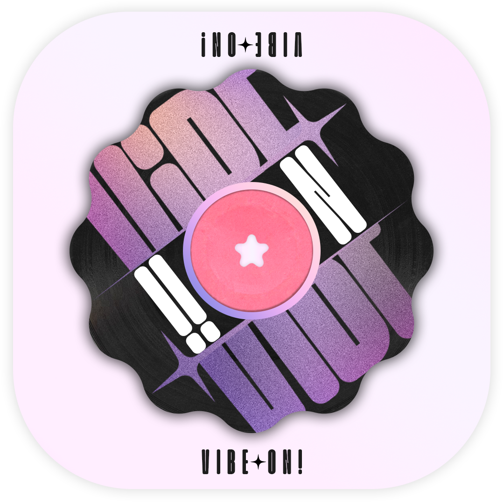
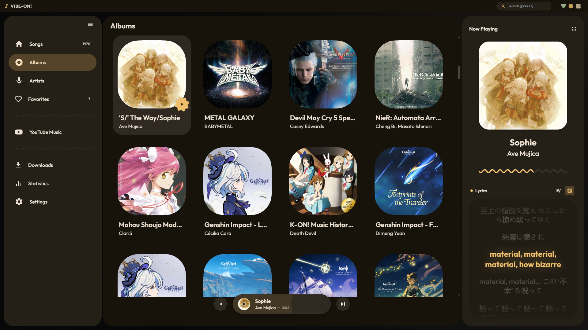
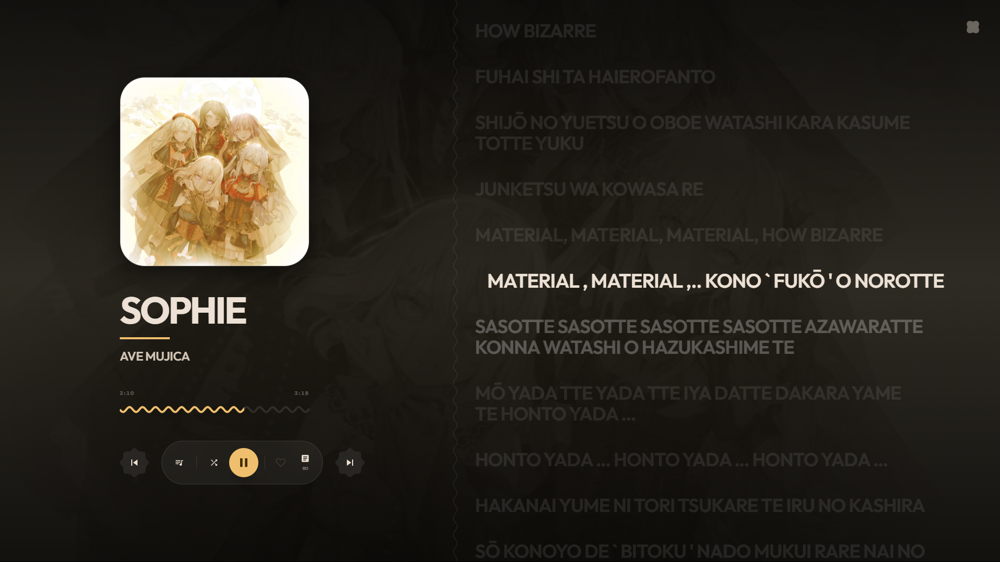

<div align="center">

<!-- Hero Section with Gradient Animation -->
<picture>
  <source media="(prefers-color-scheme: dark)" srcset="public/newvibe-on1.png">
  
</picture>

# VIBE-ON!

### **Where Your Music Universe Collides**

*The next-generation desktop experience for listening, syncing, and discovering—engineered for performance, designed for passion.*

<p align="center">
  <a href="#quick-links">🚀 Quick Links</a> •
  <a href="#experience-vibe-on">🎬 Experience</a> •
  <a href="#the-tech-behind-the-magic">⚡ Tech Stack</a> •
  <a href="#the-fellowship-collaborators">🤝 Collaborators</a>
</p>

<br />

<!-- Badge Matrix -->
<p align="center">
  
  
  
  
</p>

<p align="center">
  
  
</p>

<br />

<!-- Hero Screenshot -->

<br /><br />


</div>

<br />

---

<br />

## <a id="quick-links"></a>🎯 Quick Links

<table>
<tr>
<td align="center" width="33%">

### 📱 [**Mobile App**](https://github.com/MemestaVedas/vibe-on-android/)
**Built by [MemestaVedas](https://github.com/MemestaVedas)** - The ultimate mobile companion for your music.

</td>
<td align="center" width="33%">

### 🛠️ [**Developer Setup**](#for-developers)
Run locally and contribute to the project

</td>
<td align="center" width="33%">

### 📖 [**Documentation**](#configuration--customization)
Configuration, API keys, and customization

</td>
</tr>
</table>

<br />

---

<br />

## <a id="experience-vibe-on"></a>🎬 Experience VIBE-ON!

<div align="center">
  <h3>🌊 Your Entertainment, Unified</h3>
  <p><i>One app. Infinite possibilities. Zero compromises.</i></p>
</div>

<br />

<table>
<tr>
<td width="50%" valign="top">

### 🎨 **Dynamic Immersion**

**UI That Feels Your Music**

VIBE-ON! isn't just a player; it's a visual experience. The interface adapts continuously to the colors of your track's album art using Material 3 Expressive logic.

- 🎯 **Contextual Theming** — Palette derived entirely from your music
- 🧠 **Organic Motion** — Mathematically harmonic transitions
- 🎭 **Glassmorphic Depth** — Premium multi-layered blurred surfaces
- ⚡ **Real-time Response** — Visuals that evolve as you listen

</td>
<td width="50%" valign="top">

### 🎤 **Enhanced Lyrics Engine**

**Read Between the Lines**

Experience your music with real-time scrolling lyrics, supporting local files and smart cloud integration.

- 🌐 **LRCLIB Integration** — Access global lyrics databases instantly
- 📖 **Smart Merging** — Handles `.lrc` and `.romaji.lrc` files seamlessly
- 💾 **Local Support** — Priority for your personal lyrics collection
- 🎨 **Aesthetic Display** — Crystal-clear rendering for every word

</td>
</tr>
</table>

<br />

<div align="center">

### 📱 **Mobile Companion**

**Your Music, Everywhere**

Experience VIBE-ON! on your Android device with our dedicated companion app developed by [MemestaVedas](https://github.com/MemestaVedas/vibe-on-android).

- 📲 **Sync on the Go** — Carry your library in your pocket
- 🎮 **Remote Control** — Control your desktop player from your phone
- 🔗 **Unified Experience** — Seamlessly switches between desktop and mobile
- ⚡ **Lightweight & Fast** — Optimized for the mobile experience

👉 **[Check out the Mobile Repository](https://github.com/MemestaVedas/vibe-on-android/)**

<br />

### 🗂️ **The Neural Library Archive**

*Your media collection, reimagined as a living, breathing database*

</div>

<table>
<tr>
<td align="center" width="25%">

**🔍**<br />
**Deep Scanning**<br />
<sub>Analyzes your drives to build a comprehensive music index</sub>

</td>
<td align="center" width="25%">

**📊**<br />
**Rich Metadata**<br />
<sub>Beautiful cards with album art, descriptions, and tag info</sub>

</td>
<td align="center" width="25%">

**⚙️**<br />
**Advanced Filtering**<br />
<sub>Search, sort, and filter by genre, artist, and more</sub>

</td>
<td align="center" width="25%">

**📈**<br />
**MagicBento Dashboard**<br />
<sub>Visualize your listening habits with stunning analytics</sub>

</td>
</tr>
</table>

<br />

---

<br />

## 🎨 Design Philosophy

<div align="center">
  
**Glassmorphism Meets Technical Precision**

Every pixel is intentional. Every interaction is delightful.

</div>

<br />

<table>
<tr>
<td align="center" width="33%">

### 🪞 **Glassmorphic Depth**

Multi-layered blurred surfaces create a sense of depth and premium quality. Light adapts to your system theme for perfect visibility.

</td>
<td align="center" width="33%">

### 📐 **Material 3 Expressive**

Following strict M3 logic with 32px corners and organic motion, ensuring visual harmony across the entire interface.

</td>
<td align="center" width="33%">

### 🎬 **Fluid Animations**

Framer Motion powered micro-interactions and smooth transitions make every click, hover, and scroll feel responsive and alive.

</td>
</tr>
</table>

<br />

<div align="center">

```
┌─────────────────────────────────────────────────────────────┐
│  "We don't just play music. We create an experience         │
│   that respects your sound, your vibe, and your desktop."   │
│                                                             │
│                                    — Built by MemestaVedas  │
└─────────────────────────────────────────────────────────────┘
```

</div>

<br />

---

<br />

## <a id="the-tech-behind-the-magic"></a>⚡ The Tech Behind The Magic

<div align="center">

**Engineered for Speed. Crafted for Beauty.**

VIBE-ON! leverages bleeding-edge technology to deliver desktop-class performance with web-like flexibility.

</div>

<br />

### 🏗️ Architecture Stack

<table>
<tr>
<td width="50%">

#### **🦀 Native Foundation**
```rust
// Tauri 2.0 + Rust
- Ultra-low memory footprint
- Native system integration
- Secure IPC communication
- libp2p + QUIC for P2P Sync
```

**Powers:**
- Media player detection
- File system operations
- Discord RPC integration
- Background services

</td>
<td width="50%">

#### **⚛️ Dynamic Interface**
```typescript
// React 19 + TypeScript
- Virtual DOM efficiency
- Type-safe development
- Component reusability
- Tailwind CSS 4 Styling
```

**Delivers:**
- Fun material 3 expressive UI
- Smooth state management
- Real-time data updates
- Responsive layouts

</td>
</tr>
</table>

<br />

### 🧰 Complete Technology Matrix

| **Category** | **Technologies** |
|:-------------|:-----------------|
| **Core Runtime** | Tauri 2.0 • Rust • Tokio Async Runtime |
| **Frontend Framework** | React 19 • Vite • TypeScript 5 |
| **Networking** | libp2p • mdns-sd • WebSocket Server |
| **Styling Engine** | Tailwind CSS 4 • Framer Motion |
| **Database** | SQLite (rusqlite) • Local Storage |
| **Metadata** | Lofty (High-performance tag processing) |
| **System Integration** | Discord RPC • Deep Links • System Tray |

<br />

---

<br />

## 🚀 Getting Started

### 📦 For Users

<div align="center">

**👉 [Download the Latest Release](https://github.com/MemestaVedas/vibe-on/releases) 👈**

Available for **Windows**, **macOS**, and **Linux**

</div>

<br />

1. **Download** the installer for your platform
2. **Install** VIBE-ON! like any other desktop app
3. **Launch** and add your music directories
4. **Configure** your mobile sync settings (optional)
5. **Enjoy** the ultimate listening experience!

<br />

### <a id="for-developers"></a>🛠️ For Developers

<details>
<summary><b>📋 Click to expand developer setup guide</b></summary>

<br />

#### Prerequisites

Before you begin, ensure you have:

| Requirement | Version | Installation Guide |
|:------------|:--------|:-------------------|
| **Node.js** | v18+ | [nodejs.org](https://nodejs.org) |
| **Rust** | Latest Stable | [rustup.rs](https://rustup.rs) |
| **Tauri CLI** | Latest | [Tauri Prerequisites](https://v2.tauri.app/start/prerequisites/) |

<br />

#### Step-by-Step Setup

**1️⃣ Clone the Repository**
```bash
git clone https://github.com/MemestaVedas/vibe-on.git
cd vibe-on
```

**2️⃣ Install Dependencies**
```bash
npm install
```

**3️⃣ Launch Development Server**
```bash
npm run tauri dev
```

**4️⃣ Build for Production**
```bash
npm run tauri build
```

</details>

<br />

---

<br />

## <a id="the-fellowship-collaborators"></a>🤝 The Fellowship (Collaborators)

The architects and engineers behind the VIBE-ON! universe.

<div align="center">

| Collaborator | Role | Github |
|:--- |:--- |:--- |
| **MemestaVedas** | Founder & Lead Architect | [@MemestaVedas](https://github.com/MemestaVedas) |
| **Surajsm60720** | Core Contributor | [@Surajsm60720](https://github.com/Surajsm60720) |


</div>

<br />

## 🤝 Reach Out

Whether you have questions, suggestions, or just want to chat about the project, feel free to get in touch!

<br />

<div align="center">

**Discord:** `@memestavedas`

</div>

<br />

---

<br />

## 📜 License

This project is licensed under the **MIT License** - see the [LICENSE](LICENSE) file for details.

<br />

---

<br />

## 💖 Acknowledgments

<div align="center">

**Built with passion by music lovers, for music lovers**

Special thanks to:
- 🎨 The **Tauri** team for the incredible framework
- 📊 **Material Design** for the color utility logic
- 🎭 Every contributor and supporter of this project


<br />

---

<br />

<p>
  <strong>Created with 💙 by <a href="https://github.com/MemestaVedas">MemestaVedas</a></strong><br />
  <sub>Built for Audiophiles by an Engineer with Taste</sub>
</p>

<br />


</div>
